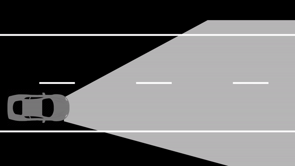
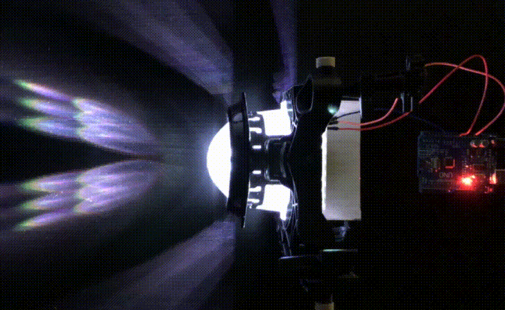

# Smart Headlight System

## Project Overview

This project demonstrates an advanced approach to modern headlight technology in vehicles. Beyond standard low and high beams, it highlights how LED flexibility can enhance road safety in low-light conditions by illuminating the road effectively while preventing glare for oncoming or preceding traffic. This is achieved through two integrated subsystems:

1. **Hardware Control Module**: Manages the LED matrix.
2. **Camera Feed with Object Detection**: Detects and locates vehicles using a trained object detection model, determining areas to lighten or darken.


---

## Getting Started

### Components
To set up the project, download the following folders:
- **[LEDController](LEDController)**: Contains the Arduino sketch for controlling the LED matrix.
- **[Python](Python)**: Includes the `vehicleDetect.py` script, a pre-trained model, and `label_map.pbtxt` for object detection.

### Hardware Requirements
- Arduino UNO microcontroller
- CJMCU 64-bit WS2812 RGB LED Matrix
- Headlight projector lens
- USB webcam
- Required cables

### Software Requirements
- Arduino IDE: [Download](https://www.arduino.cc/en/main/software)
- Python 3.6 or higher: [Download](https://www.python.org/downloads/)
- TensorFlow Object Detection API: [GitHub Repository](https://github.com/tensorflow/models)
- Microsoft Visual Studio: [Download](https://visualstudio.microsoft.com/free-developer-offers/)

### Python Dependencies
Install the following Python packages:
- OpenCV: `opencv-python`
- TensorFlow: Version 1.10.0
- Numpy: Version 1.14.5
- PyAutoGUI, Serial, and Utils

Additionally, install the `FastLED.h` library in the Arduino IDE for controlling the LED matrix.

---

## Code Functionality

### Vehicle Detection
The `vehicleDetect.py` script:
1. Uses a webcam feed to detect vehicles via a pre-trained TensorFlow model.
2. Identifies vehicle positions, storing x-coordinates in variables (`medX1` and `medX2`).
3. Based on detected vehicles, constructs a `posX` variable:
   - Handles up to two vehicles simultaneously.
   - Encodes positions to ensure relevant LED columns are darkened dynamically.
4. Sends `posX` to the Arduino microcontroller via a serial connection to control the LED matrix.

### LED Control
- The matrix has 64 LEDs, divided into two sections:
  - 32 LEDs for low beams (always ON).
  - 32 LEDs for high beams (dynamically controlled).
- The LEDs are grouped into 8 columns, individually controlled to darken areas corresponding to detected vehicles.
- If more than two vehicles are detected, high beams turn OFF to maintain efficiency.

### Object Detection Training
- A custom object detection model trained on over 500 nighttime driving images.
- Images were labeled using [LabelImg](https://github.com/heartexlabs/labelImg) and split into 80% training and 20% testing datasets.
- The `ssd_inception_v2_coco` model from TensorFlow was used for training.



---

## Deployment

### Step 1: Set Up Hardware
1. Connect the Arduino Uno to your PC via USB.
2. Upload `LEDController.ino` to the Arduino board using the Arduino IDE.
3. Connect the Arduino to the LED matrix:
   - Arduino GND pin to LED GND.
   - Arduino 5V pin to LED 5V.
   - Arduino Pin 5 to LED DOUT.
4. Position a projector lens in front of the LED matrix for beam dispersion.
5. Ensure the webcam is operational and provides a nighttime driving video feed.

### Step 2: Run the Python Script
1. Ensure the following files are in the same directory:
   - `vehicleDetect.py`
   - `label_map.pbtxt`
   - `inference_graph` folder with the trained model and checkpoints.
2. Run the script:
   ```bash
   python vehicleDetect.py
   ```
3. Observe:
   - Detected vehicles wrapped with bounding boxes labeled "vehicle".
   - Real-time adjustment of LED matrix columns to darken areas around detected vehicles.

---
## Hardware Setup (excluding the camera)


